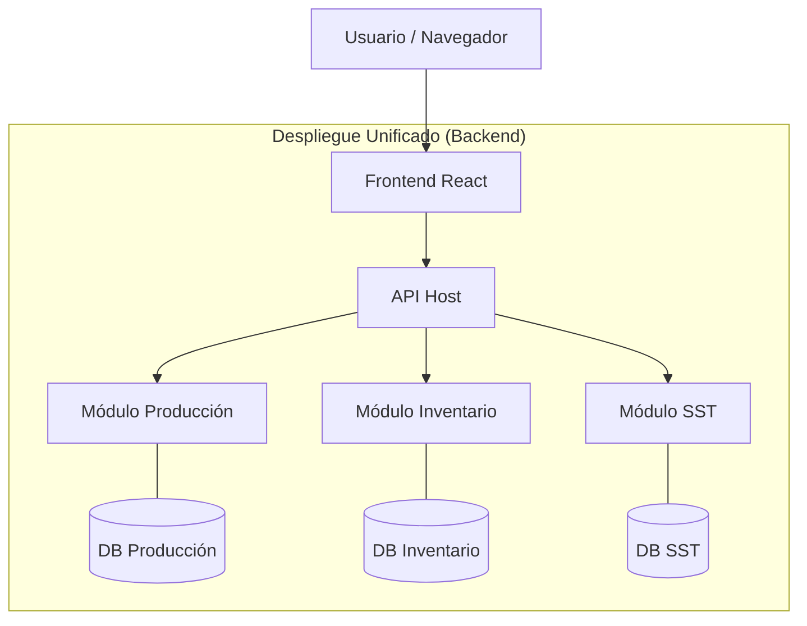

# Arquitectura Perla ERP: Monolito Modular

Este documento explica la filosofía técnica detrás de **Perla**, diseñada para ser escalable, mantenible y de alto rendimiento.

## 🏗️ ¿Qué es un Monolito Modular?

Un Monolito Modular es un estilo arquitectónico que estructura la aplicación en **módulos independientes y bien definidos** dentro de una única unidad de despliegue. Combina la simplicidad de un monolito con la flexibilidad lógica de los microservicios.

---

## 🖥️ Backend (.NET 9)

El backend de Perla sigue una estructura de **Monolito Modular** puro con **Clean Architecture**.

### Estructura de Carpetas
Cada módulo es un "mini-proyecto" autónomo:

- **`Host/`**: El punto de entrada (API). Configura y arranca todos los módulos.
- **`Modules/`**: Contiene la lógica de negocio segmentada.
  - **`Módulo.Domain/`**: Entidades, reglas de negocio y lógica pura.
  - **`Módulo.Infrastructure/`**: Base de datos (EF Core), persistencia y servicios externos.
  - **`Módulo.Api/`**: Controladores y endpoints específicos.
- **`Shared/`**: Kernel compartido con utilidades, logs y tipos comunes.

### Reglas de Oro
1. **Independencia de Datos**: Los módulos no acceden a las tablas de otros módulos. Se comunican mediante servicios o eventos.
2. **Despliegue Único**: Todo corre en un solo proceso, lo que facilita el hosting y las pruebas.

---

## 🌐 Frontend (React 19)

El frontend aplica el mismo concepto mediante una **Arquitectura Basada en Características (Features)**.

### Estructura de Carpetas
```text
frontend/src/
  ├── features/
  │   ├── production/      # Todo lo relacionado a Producción
  │   ├── inventory/       # Todo lo relacionado a Inventario
  │   └── ...
  ├── components/          # Componentes globales (Layout, Sidebar, Modales comunes)
  └── App.jsx               # El "Orquestador" central
```

### Ventajas en el Frontend
- **Encapsulamiento**: Lo que pasa en un módulo no afecta al otro.
- **Carga Diferida (Lazy Loading)**: El navegador solo descarga el código del módulo que el usuario está usando.
- **Orden Visual**: Los archivos de una funcionalidad están agrupados, no dispersos.

---

## 🚀 Beneficios para el Proyecto

1. **Escalabilidad**: Podemos añadir módulos (SST, Calidad, Gestión Humana) sin miedo a romper lo existente.
2. **Mantenibilidad**: Es fácil encontrar errores y actualizar lógica sin efectos secundarios impredecibles.
3. **Migración Futura**: Si un módulo crece demasiado, se puede extraer a un microservicio independiente con mínimo esfuerzo.

---

## 📊 Diagrama de Flujo


